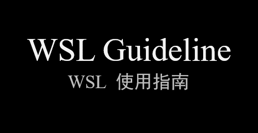

# WSL Guideline 

### 这是WSL（Win10的Linux子系统）的进阶使用指南，在这里，你将学习到：  

1. 如何为WSL安装桌面环境（以运行图形界面程序）  

2. 解决WSL中常见问题

3. 用脚本部署一些自动化操作

&emsp;&emsp;......

### 在开始之前，你需要知道：

1. 使用WSL意味着你需要了解Linux系统的基础操作，而“WSL Guideline”**不会**讲解Linux系统的基础操作。

2. WSL虽然强大，但是作为子系统仍有一些底层的限制，WSL**不能**完全替代Linux发行版

### Let's go!

* [《WSL使用指南》（中文）][1]  
* [《WSL Guideline》(English Version Not Started)][2]

[1]:./WSL-Guideline/中文/00-项目愿景.md

[2]:./WSL-Guideline/English/00-About.md

---

因时间仓促并且水平有限，如有疏漏，请各位不吝赐教！  
该项目的文章也会发布在我的[知乎专栏](https://zhuanlan.zhihu.com/WindowsSubsystemForLinux)

---
本作品采用[知识共享署名-非商业性使用-相同方式共享 4.0 国际许可协议][privacy]进行许可。欢迎转载、使用、重新发布，但务必保留文章署名Wang Jiaxiang（包含链接：[https://github.com/iWangJiaxiang/WSL-Guideline][github]），不得用于商业目的，基于本文修改后的作品务必以相同的许可发布。如有任何疑问，请[与我联系][contact]。 

[privacy]:https://creativecommons.org/licenses/by-nc-sa/4.0/
[github]:https://github.com/iWangJiaxiang/WSL-Guideline
[contact]:mailto:iWangJiaxiang@outlook.com
