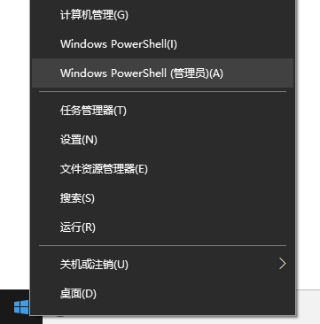
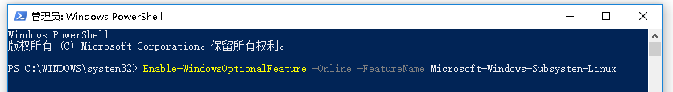
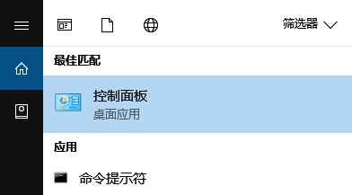
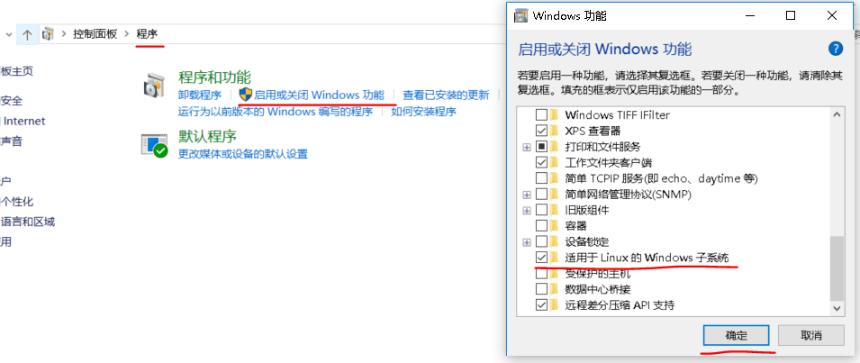
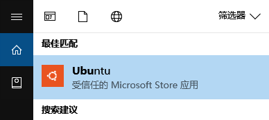
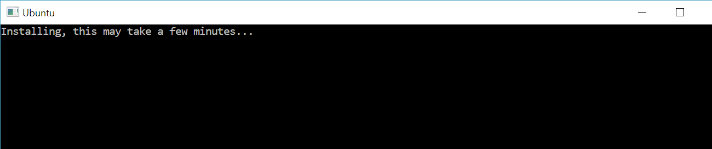
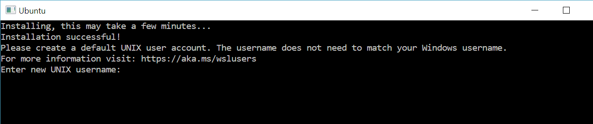

# WSL 使用指南

### 02 安装指南

#### 启动Windows Subsystem for Linux

&emsp;&emsp;开始WSL之旅的第一步是`启动Windows Subsystem for Linux功能`，有两种方法实现：

##### 通过命令行

1. 以`管理员`身份打开`PowerShell`。

    右键单击屏幕左下角`“开始”`菜单，找到“Windows PowerShell(管理员)”并打开

&emsp;&emsp;

2. 复制以下命令并运行

       Enable-WindowsOptionalFeature -Online -FeatureName Microsoft-Windows-Subsystem-Linux

&emsp;&emsp;

3. 安装完成后重启电脑~

##### 通过控制面板

1. 打开控制面板

    打开屏幕左下角“Cortana搜索框”输入“control panel”搜索并打开搜索结果中的“控制面板”

&emsp;&emsp;

&emsp;&emsp;

2. 找到启用或关闭Windows功能

    如图所示，打开“程序”——“启用或关闭Windows功能”，找到并勾选“适用于Linux的Windows子系统”，点击“确定”。

&emsp;&emsp;

3. 安装完成后重启电脑~

#### 通过应用商店安装Linux发行版

##### 启动WSL支持之后，安装Linux发行版的步骤如下

1. 打开Win10[应用商店][MSStore]搜索你喜欢的Linux发行版并安装。目前，WSL支持[Ubuntu][ubuntu-l]，[Kali Linux][kali-l]，[GNU][GNU-l]，[OpenSUSE][suse-l]等发行版。**通过应用商店安装的Linux发行版只支持安装在`C`盘！**

2. 以安装`Ubuntu`为例，安装完成后搜索并打开`Ubuntu`执行后续安装。

&emsp;&emsp;

&emsp;&emsp;

3. 安装完成后按提示输入默认用户名、密码。

&emsp;&emsp;

4. 全部完成！今后我们可以通过`Ubuntu`应用打开一个WSL的Ubuntu命令行窗口。

5. Enjoy!

* 更多信息请参阅微软官方文档[Install the Windows Subsystem for Linux](https://docs.microsoft.com/en-us/windows/wsl/install-win10)和[Automatically Configuring WSL](https://blogs.msdn.microsoft.com/commandline/2018/02/07/automatically-configuring-wsl/)

---
#### 下一步

* 避开WSL[常见的坑](03-避免的坑.md)

[MSStore]:https://www.microsoft.com/zh-cn/store/apps/

[ubuntu-l]:https://www.microsoft.com/zh-cn/store/p/ubuntu/9nblggh4msv6

[kali-l]:https://www.microsoft.com/zh-cn/store/p/kali-linux/9pkr34tncv07

[suse-l]:https://www.microsoft.com/zh-cn/store/p/opensuse-leap-42/9njvjts82tjx

[GNU-l]:https://www.microsoft.com/zh-cn/store/p/debian-gnu-linux/9msvkqc78pk6