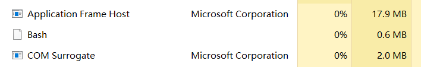
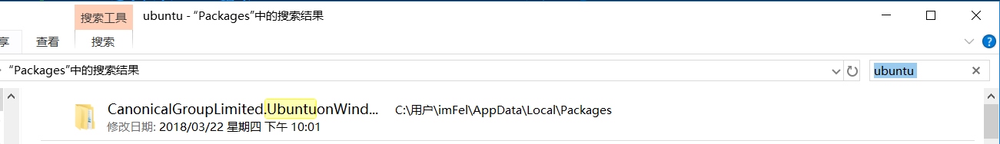

# WSL 使用指南

### 03 避免的坑

#### 端口

&emsp;&emsp;WSL和Win10共享同一套端口，如果出现两者监听同一个端口的情况，Windows主系统的程序拥有更高的优先级。也就是说，如果我们在WSL运行需要监听端口的程序，必须确认该端口没有被Windows主系统内的任何程序占用。如果出现冲突，请参阅软件相关文档修改默认配置。

&emsp;&emsp;例如，在WSL中安装`SSH Server`时，端口冲突将会导致WSL不能按照预期通过SSH连接登陆，但只需修改默认WSL的SSH监听端口，问题便迎刃而解。

>众所周知，SSH的默认连接端口是`22`，但是微软在Win10中内置了`SSH Server For Windows`并占用了默认的`22`端口，因此如果要在WSL中开启`SSH Server`，我们必须修改WSL中的默认SSH监听端口。   
——[WSL Guideline 06-配置SSH][06-配置SSH]

#### 后台运行Linux程序

&emsp;&emsp;当我们在WSL运行后台程序时（如在命令后加`&`）,后台程序会随着WSL所有`Session`的关闭而停止运行（每一个`Session`对应任务管理器中一个`Bash`进程，如下图）。即，如果我们把WSL的`Bash`窗口全部关闭的话，WSL的后台程序会被强制停止。这个机制虽然能够避免WSL内程序计划外运行，但是在执行后台任务时WSL命令行图标常驻在`任务栏`会破坏桌面的简洁……

&emsp;&emsp;

&emsp;&emsp;为了取消WSL`Bash`窗口图标常驻在任务栏，我们可以开启一个`窗口隐藏`的`Bash`进程常驻在后台，这样后台程序就不会因为**可见**的WSL`Bash`窗口关闭而停止运行了————因为一直都有**不可见**的WSL命令行常驻在后台~~启动`隐藏窗口`方法如下：

1. 打开`PowerShell`。

2. 执行以下命令

        powershell.exe -WindowStyle Hidden -c bash

&emsp;&emsp;之后你会在任务管理器发现这个`Bash`后台进程，你的Linux程序可以后台运行了。为了省去每次开机输入命令的麻烦，我们可以把此命令添加到`任务计划`。

&emsp;&emsp;如果你的WSL安装了多个Linux发行版，上文命令最后的参数`bash`只能打开WSL默认的Linux发行版`Bash`窗口（通常为`Ubuntu`）。因此，为了打开确定的Linux发行版`Bash`窗口，我们需要将最后的参数`bash`修改为我们安装的Linux发行版名。假设我们同时安装了`Ubuntu`发行版和`Kali Linux`发行版，那么执行命令

    powershell.exe -WindowStyle Hidden -c ubuntu
    
将打开`Ubuntu`的`Bash`进程，执行命令

    powershell.exe -WindowStyle Hidden -c kali
    
将打开`Kali Linux`的`Bash`进程，但是两者的`Bash`进程显示名称相同，需要pid来区分对应的Linux发行版。

&emsp;&emsp;关于后台运行Linux程序，在[通过脚本提高效率](07-通过脚本提高效率.md)这篇文章中会有进一步的应用。

#### 文件系统

&emsp;&emsp;WSL和Windows主系统之间的文件系统是可以互相访问的。

&emsp;&emsp;如果在WSL中访问Windows系统的文件，可在根目录下`/mnt/`看到对应Windows盘符字母的文件夹，通过这些文件夹即可访问Windows的文件系统。

&emsp;&emsp;如果在Windows系统中访问WSL的文件，可在Windows系统中找到已安装Linux发行版的应用数据文件夹，所有Linux系统的数据都在那个文件夹（通过应用商店安装的Linux发行版本质上也是一个应用）。Linux发行版的数据文件夹在`C:\Users\{你的用户名}\AppData\Local\Packages\{Linux发行版包名}\LocalState\rootfs`路径内，在`rootfs`文件夹内我们会看到在WSL中的根目录。   
&emsp;&emsp;确定`Linux发行版包名`可在上级文件夹`Packages`内搜索你安装的Linux发行版名称，如图：

&emsp;&emsp;

* **注：在Windows下对WSL文件修改可能会造成权限错误**

---
#### 下一步

* [安装桌面环境](04-安装桌面环境.md)

[06-配置SSH]:06-配置SSH.md

---
本作品采用[知识共享署名-非商业性使用-相同方式共享 4.0 国际许可协议][privacy]进行许可。欢迎转载、使用、重新发布，但务必保留文章署名Wang Jiaxiang（包含链接：[https://github.com/WangJiaxiang96/WSL-Guideline][github]），不得用于商业目的，基于本文修改后的作品务必以相同的许可发布。如有任何疑问，请[与我联系][contact]。 

[privacy]:https://creativecommons.org/licenses/by-nc-sa/4.0/
[github]:https://github.com/WangJiaxiang96/WSL-Guideline
[contact]:mailto:wangjiaxiang96@outlook.com