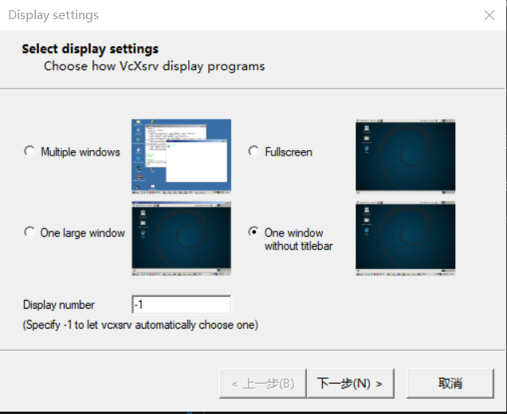
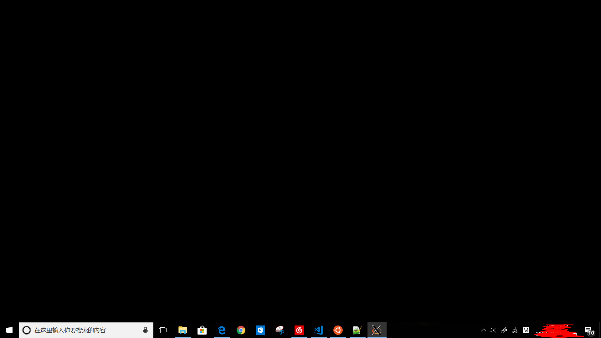
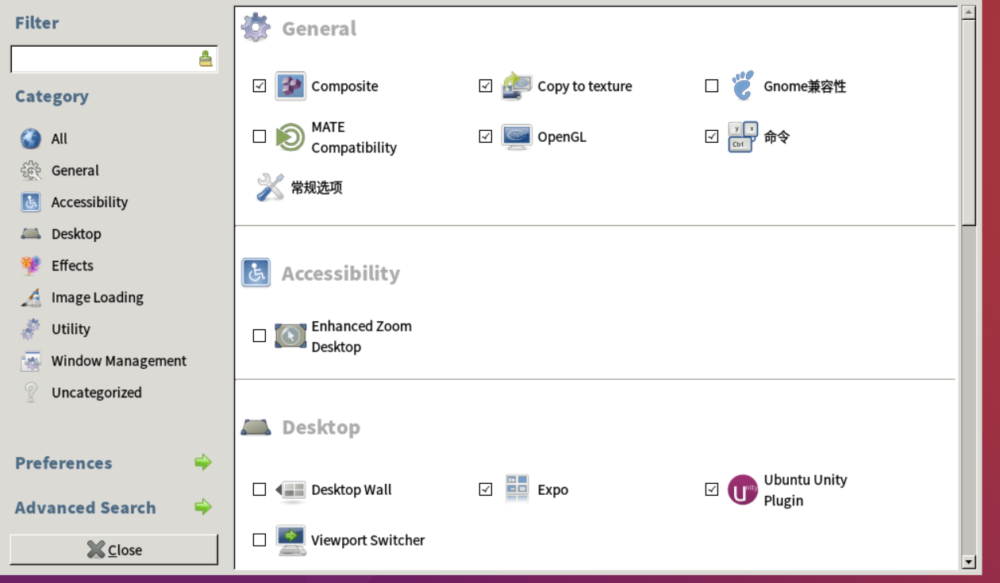
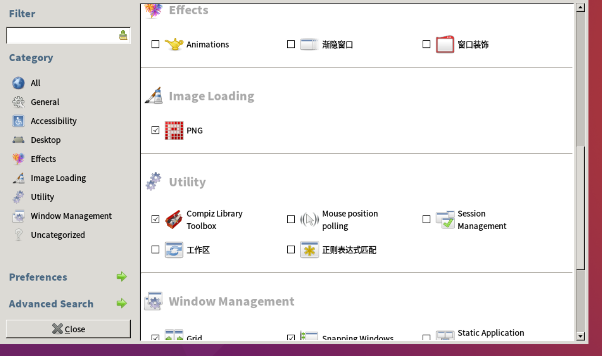
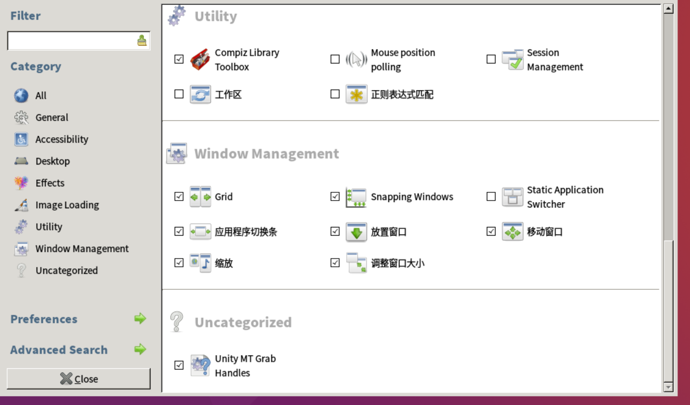
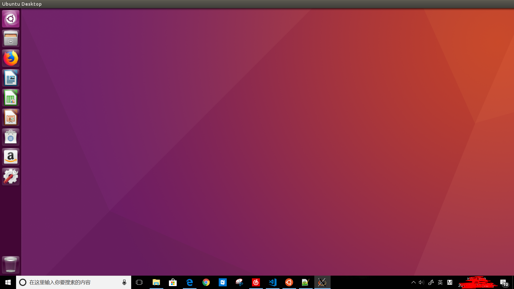

# WSL 使用指南

### 04 安装桌面环境

#### 安装桌面

&emsp;&emsp;嗯，使用WSL后你一定开始怀念Linux双系统的桌面环境了……

&emsp;&emsp;WSL的初衷是为了在Windows系统中运行Linux工具链，所以WSL没有“原生”搭载桌面环境，但这不影响我们自己安装一个Linux桌面环境。

&emsp;&emsp;以`Ubuntu`为例，为WSL安装桌面环境需要两大项工作————在Win10中安装`X Server`、在WSL中安装`Ubuntu桌面`等组件。

##### 安装X Server

&emsp;&emsp;下载并安装[VcXsrv](https://sourceforge.net/projects/vcxsrv/)，安装之后桌面会出现两个快捷方式分别为`VcXsrv`和`XLaunch`。

##### 安装Ubuntu桌面

&emsp;&emsp;在Windows系统中安装`X Server`后，开始在WSL中通过命令行安装Ubuntu桌面组件，步骤如下：

1. 更新系统

        sudo apt-get update && sudo apt-get upgrade

2. 安装桌面组件，该过程需要一些时间，请坐和放宽~~

        echo "y"|sudo apt-get install ubuntu-desktop unity compizconfig-settings-manager

3. 配置dbus以避免出现错误

        dpkg-reconfigure dbus && service dbus restart

#### 配置桌面

&emsp;&emsp;所需组件安装完成之后，接下来开始配置工作，步骤如下：

1. 打开Windows主系统桌面的`XLaunch`图标，并按照图示操作。

&emsp;&emsp;

2. 点击下一步保持默认设置直到最后完成，此时我们会看到一个纯黑色的无标题栏窗口（黑色的原因是没有任何`X Client`连接）。

&emsp;&emsp;

3. 切换到`Ubuntu`的`Bash`窗口，执行以下命令配置`X Server`端口。

        export DISPLAY=localhost:0

4. 执行以下命令，然后切换到VcXsrv窗口（即之前打开的纯黑色窗口）

        sudo ccsm

5. 按照下图设置桌面环境并退出，如果提示遇到冲突则选择忽略冲突即可。

&emsp;&emsp;

&emsp;&emsp;

&emsp;&emsp;

6. 切换到`Ubuntu``Bash`窗口，执行以下命令并切换回`VcXsrv`窗口查看效果。

        sudo compiz

&emsp;&emsp;

7. Enjoy!

#### 安装中文支持并配置profile文件

1. 在桌面环境打开一个`终端`，执行以下命令安装中文支持（如果当前不是用户`root`，命令前面要加上`sudo`）

        apt-get -y install language-pack-zh-hans

2. 将以下环境变量添加到`/etc/profile`文件

        export DISPLAY=localhost:0

        export LANG=zh_CN.UTF-8
        export LANGUAGE=zh_CN.UTF-8
        export LC_ALL=zh_CN.UTF-8

3. 重新加载`profile`

        source /etc/profile

4. 重新生成`locale`

        locale-gen
        
* **注意！我们开启桌面后是root账户，有可能会影响WSL稳定性！**
* 如果需要以其他用户启动桌面环境，必须重新配置`ccsm`及其他组件，当然我们也可以把已经配置好的配置文件复制到其他账户下，方法为——把将已配置桌面环境的用户目录（`cd ~`）下`.cache`文件夹复制到其他用户目录下。

* Ubuntu桌面环境的安装方法参考了[Run any Desktop Environment in WSL](https://github.com/Microsoft/WSL/issues/637)

---
#### 下一步

* 美化桌面环境见[自定义桌面环境](05-自定义桌面环境.md)

* 桌面环境的进一步探索见[通过脚本提高效率](07-通过脚本提高效率.md)

---
本作品采用[知识共享署名-非商业性使用-相同方式共享 4.0 国际许可协议][privacy]进行许可。欢迎转载、使用、重新发布，但务必保留文章署名Wang Jiaxiang（包含链接：[https://github.com/WangJiaxiang96/WSL-Guideline][github]），不得用于商业目的，基于本文修改后的作品务必以相同的许可发布。如有任何疑问，请[与我联系][contact]。 

[privacy]:https://creativecommons.org/licenses/by-nc-sa/4.0/
[github]:https://github.com/WangJiaxiang96/WSL-Guideline
[contact]:mailto:wangjiaxiang96@outlook.com