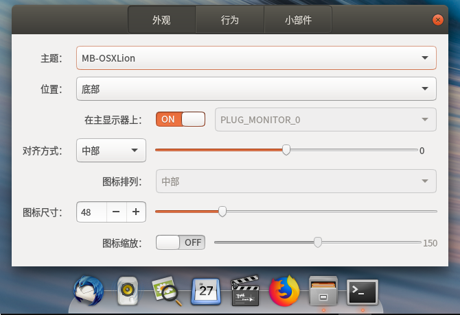
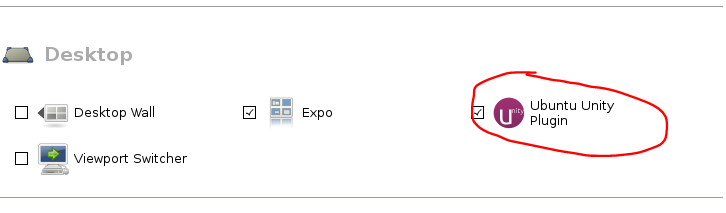
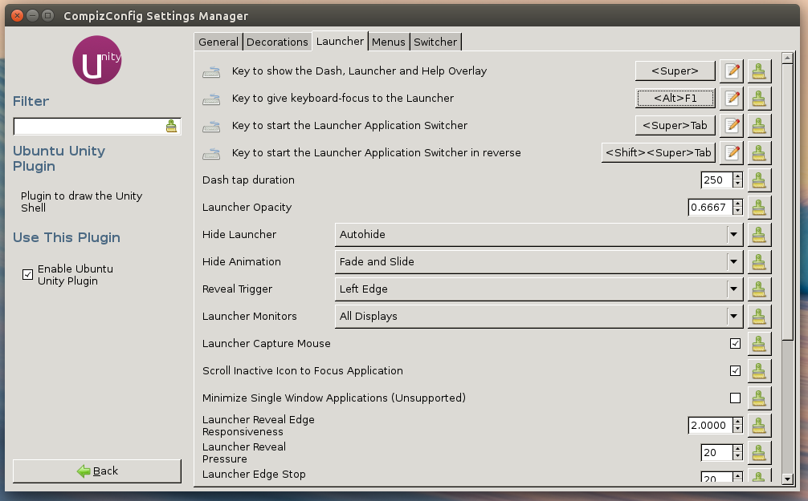
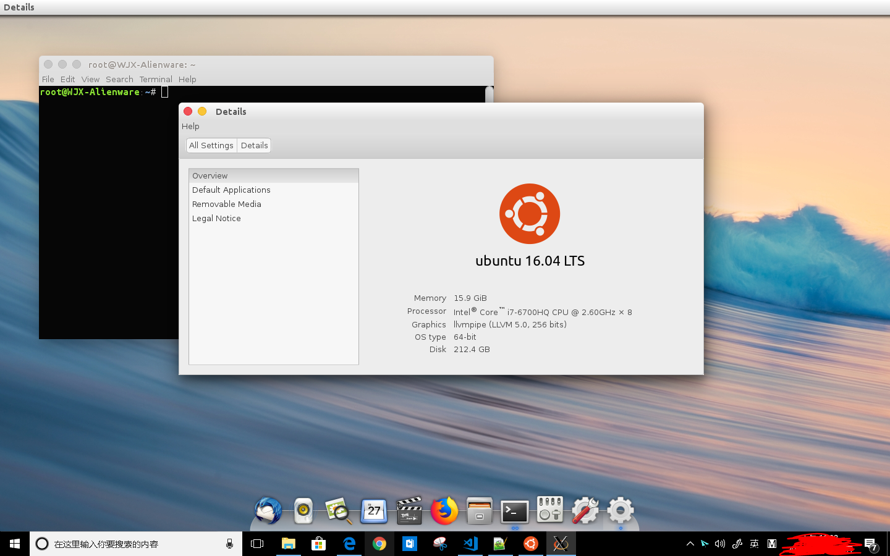

# WSL 使用指南

### 05 自定义桌面环境

&emsp;&emsp;当我们完成[安装桌面环境](04-安装桌面环境.md)后，我们或许希望改变一成不变的桌面环境UI，不过在尝试通过系统设置美化UI时，我们会发现这并不起作用……

&emsp;&emsp;对于这个问题，我们的解决方案是，强制替换默认主题、图标等文件……简单粗暴，但十分有效！步骤如下：

1. 以Macbuntu主题为例，首先我们安装Macbuntu主题。在WSL Ubuntu发行版安装完成后桌面环境中打开一个终端，执行以下命令添加并更新源：

        add-apt-repository ppa:noobslab/macbuntu && echo "y" | apt-get update

2. 安装主题组件。

        echo "y" | apt-get install macbuntu-os-icons-lts-v7 && echo "y" | apt-get install macbuntu-os-ithemes-lts-v7 && echo "y" | apt-get install plank && echo "y" | apt-get install macbuntu-os-plank-theme-lts-v7

3. 将面板上的 ‘Ubuntu Desktop’ 文字替换 ‘Mac’。如果你的Ubuntu没有安装中文语言，请把命令中的`zh_CN`替换为`en`。

        cd && wget -O Mac.po http://drive.noobslab.com/data/Mac/change-name-on-panel/mac.po && cd /usr/share/locale/zh_CN/LC_MESSAGES; msgfmt -o unity.mo ~/Mac.po;rm ~/Mac.po;cd

4. 设置启动器上苹果Logo。

        wget -O launcher_bfb.png http://drive.noobslab.com/data/Mac/launcher-logo/apple/launcher_bfb.png && mv launcher_bfb.png /usr/share/unity/icons/

5. 安装`Tweak tool`软件管理主题、图标等。

        echo "y" | apt-get install unity-tweak-tool && echo "y" | apt-get install gnome-tweak-tool

6. 配置Mac字体。

        wget -O mac-fonts.zip http://drive.noobslab.com/data/Mac/macfonts.zip && unzip mac-fonts.zip -d /usr/share/fonts; rm mac-fonts.zip && fc-cache -f -v

7. 在Ubuntu桌面环境打开`Setting`-`Appearence`设置桌面壁纸（壁纸见参考）。

8. 打开Ubuntu桌面环境的`文件管理器`，进入`/usr/share/themes`文件夹，`themes`文件夹内`Ambiance`文件夹就是默认主题文件夹。如果要修改主题，将`Ambiance`文件夹重命名为`Ambiance.backup`，然后将`themes`文件夹内其他主题文件夹（这里选择`MacBuntu-OS-Unity-X`）重命名为`Ambiance`即可，**这种修改在下次启动桌面环境时生效**。

9. 在终端执行命令配置Plank Docker主题，如图。

        plank --preferences

&emsp;&emsp;

10. 接下来设置自动隐藏桌面左侧`Launcher`，在终端输入`ccsm`，进入桌面环境配置界面，点击`Ubuntu Unity Plugin`。

&emsp;&emsp;

11. 在`Ubuntu Unity Plugin`界面选择`Launcher`标签，将`Hide Launcher`选项设置为`Autohide`。之后可通过快捷键`Alt+F1`显示`Launcher`。

&emsp;&emsp;

12. 目前为止桌面主题的替换已经完成（运行`gnome-tweat-tool`可进行更多设置）切换到Windows系统的`Ubuntu Bash窗口`，按下`Ctrl + C`停止运行桌面，输入以下命令查看效果。

        su - root
        nohup compiz >/dev/null 2>&1 &
        nohup plank >/dev/null 2>&1 &

&emsp;&emsp;

* 主题安装参考[Ubuntu 16.04下安装MacBuntu 16.04 TP 变身Mac OS X主题风格](https://www.linuxidc.com/Linux/2016-06/131947.htm)

13. Enjoy!

---
#### 下一步

* 了解[WSL中SSH Server配置](06-配置SSH.md)