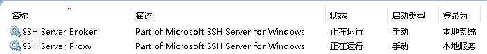
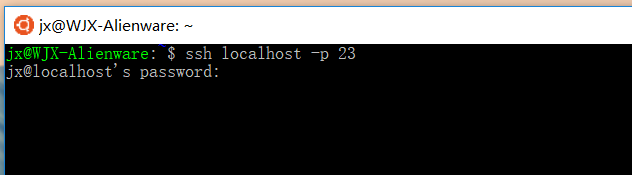

# WSL 使用指南

### 06 配置SSH

&emsp;&emsp;众所周知，SSH的默认连接端口是`22`，但是微软在Win10中内置了`SSH Server For Windows`并占用了默认的`22`端口，因此如果要在WSL中开启`SSH Server`，我们必须修改WSL中的默认SSH监听端口。Win10新增的SSH Server服务如下：

&emsp;&emsp;    
&emsp;&emsp;配置SSH Server的步骤如下：

1. 修改SSH Server的监听端口，这里修改外`23`。

        sudo sed -i '/Port /c Port 23' /etc/ssh/sshd_config

2. 修改SSH Server的监听地址。

        sudo sed -i '/ListenAddress 0.0.0.0/c ListenAddress 0.0.0.0' /etc/ssh/sshd_config

3. 按照个人需求配置密码登陆或者密钥登陆，在此不做演示

4. 重启SSH服务，本地已经能够通过SSH登陆。

        sudo service ssh restart

&emsp;&emsp;   

5. 如需外部访问，请在Windows防火墙中允许自定义的SSH端口。

---
#### 下一步

* 了解如何[通过脚本提高效率](07-通过脚本提高效率.md)